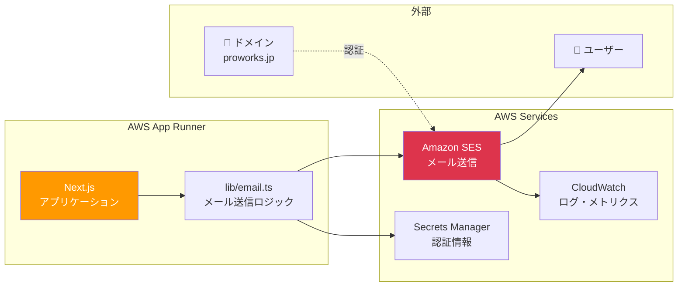
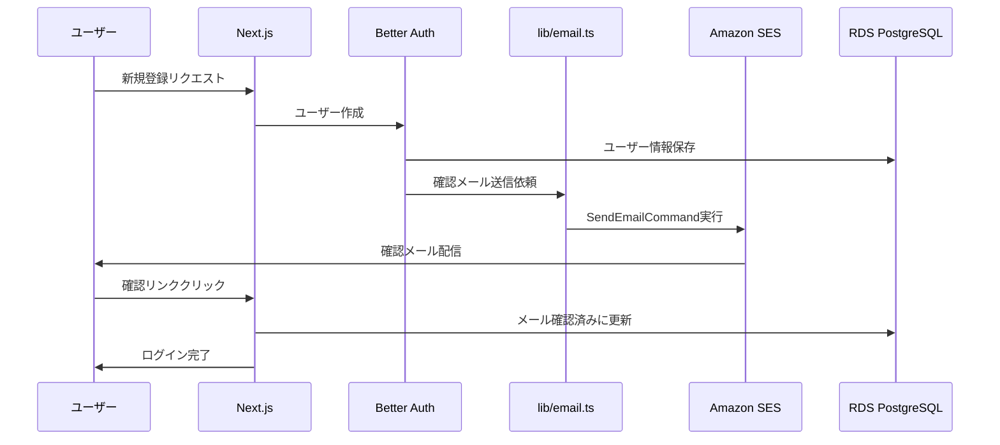
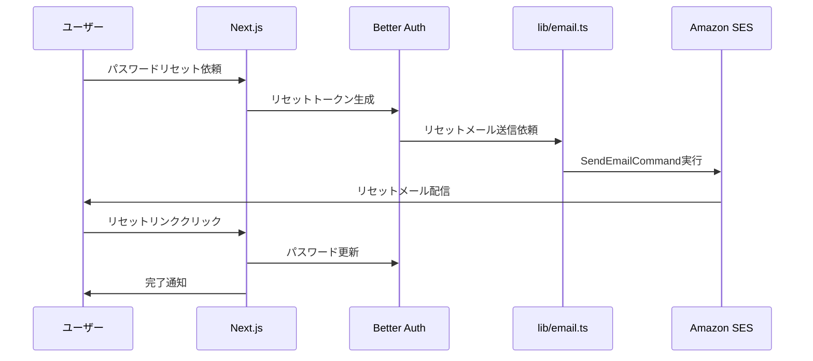
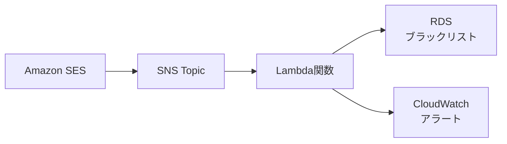

# Amazon SES メール送信アーキテクチャ

## 📋 概要

このドキュメントは、ProWorks アプリケーションにおける Amazon SES（Simple Email Service）を使用したメール送信システムのアーキテクチャを説明します。

---

## 1. Amazon SES とは

Amazon SES（Simple Email Service）は、AWS が提供するクラウドベースのメール送信サービスです。

### 主な特徴

| 特徴                 | 説明                                                   |
| -------------------- | ------------------------------------------------------ |
| **完全従量課金**     | 送信した分だけ課金（$0.10/1,000 通 = 約 ¥15/1,000 通） |
| **高い到達率**       | AWS のインフラによる高い配信成功率                     |
| **スケーラビリティ** | 大量送信にも対応可能                                   |
| **送信レート制御**   | 段階的に送信レート上限が上がる仕組み                   |
| **詳細な分析**       | バウンス・苦情・配信状況の追跡                         |

---

## 2. システムアーキテクチャ

### 全体構成図



---

## 3. メール送信フロー

### 3.1 ユーザー登録時の確認メール



### 3.2 パスワードリセット



---

## 4. 実装詳細

### 4.1 メール送信ライブラリ（lib/email.ts）

```typescript
import { SESClient, SendEmailCommand } from "@aws-sdk/client-ses";

// SESクライアント初期化
const sesClient = new SESClient({
  region: process.env.AWS_SES_REGION || "ap-northeast-1",
  credentials: {
    accessKeyId: process.env.AWS_ACCESS_KEY_ID!,
    secretAccessKey: process.env.AWS_SECRET_ACCESS_KEY!,
  },
});

// メール送信関数
const sendEmail = async ({ to, subject, html, text }) => {
  const command = new SendEmailCommand({
    Source: process.env.EMAIL_FROM,
    Destination: {
      ToAddresses: [to],
    },
    Message: {
      Subject: {
        Data: subject,
        Charset: "UTF-8",
      },
      Body: {
        Html: {
          Data: html,
          Charset: "UTF-8",
        },
        Text: {
          Data: text,
          Charset: "UTF-8",
        },
      },
    },
  });

  await sesClient.send(command);
};
```

### 4.2 環境変数

| 変数名                  | 説明                         | 例                                |
| ----------------------- | ---------------------------- | --------------------------------- |
| `AWS_SES_REGION`        | SES リージョン               | `ap-northeast-1`                  |
| `AWS_ACCESS_KEY_ID`     | AWS 認証情報（IAM ユーザー） | `AKIA...`                         |
| `AWS_SECRET_ACCESS_KEY` | AWS 認証情報（シークレット） | `secret...`                       |
| `EMAIL_FROM`            | 送信元メールアドレス         | `PRO WORKS <noreply@proworks.jp>` |

---

## 5. ドメイン認証設定

### 5.1 必要な設定

Amazon SES でメールを送信するには、ドメイン認証が必要です。

| 設定                    | 目的                 | 必須    |
| ----------------------- | -------------------- | ------- |
| **Domain Verification** | ドメイン所有権の証明 | ✅ 必須 |
| **DKIM**                | メール改ざん防止     | ⭐ 推奨 |
| **SPF**                 | 送信元認証           | ⭐ 推奨 |
| **DMARC**               | なりすまし対策       | ○ 推奨  |

### 5.2 DNS 設定例（proworks.jp）

#### Domain Verification（TXT レコード）

```
_amazonses.proworks.jp  TXT  "verification-token-here"
```

#### DKIM（CNAME レコード × 3）

```
token1._domainkey.proworks.jp  CNAME  token1.dkim.amazonses.com
token2._domainkey.proworks.jp  CNAME  token2.dkim.amazonses.com
token3._domainkey.proworks.jp  CNAME  token3.dkim.amazonses.com
```

#### SPF（TXT レコード）

```
proworks.jp  TXT  "v=spf1 include:amazonses.com ~all"
```

#### DMARC（TXT レコード）

```
_dmarc.proworks.jp  TXT  "v=DMARC1; p=quarantine; rua=mailto:dmarc@proworks.jp"
```

---

## 6. サンドボックスと Production Access

### 6.1 サンドボックス制限

SES アカウントは初期状態で「サンドボックス」モードです。

| 制限           | サンドボックス       | Production     |
| -------------- | -------------------- | -------------- |
| 送信先         | 検証済みアドレスのみ | 任意のアドレス |
| 送信レート     | 1 通/秒              | 段階的に上昇   |
| 1 日の送信上限 | 200 通               | 段階的に上昇   |

### 6.2 Production Access 申請

本番環境でメール送信するには、**Production Access 申請**が必要です。

#### 申請手順

1. AWS SES コンソールを開く
2. 「Account dashboard」→「Request production access」をクリック
3. 以下の情報を入力：
   - **Use case**: Transactional（トランザクションメール）
   - **Website URL**: https://proworks.jp
   - **Use case description**: ユーザー登録確認メール、パスワードリセット、案件通知等
   - **Compliance**: 個人情報保護法、オプトアウト対応
   - **Bounce handling**: CloudWatch 監視、自動処理
4. 申請送信（通常 1〜2 営業日で承認）

---

## 7. 送信レート管理

### 7.1 送信レート制限

SES には送信レート制限があります。

| 項目               | 初期値  | 上限値（段階的に上昇） |
| ------------------ | ------- | ---------------------- |
| **送信レート**     | 1 通/秒 | 〜1,000 通/秒          |
| **1 日の送信上限** | 200 通  | 〜数百万通             |

### 7.2 レート上限の引き上げ

- 送信実績に応じて自動的に上限が上がる
- 手動で引き上げリクエストも可能（AWS Support ケース作成）

### 7.3 実装での考慮事項

```typescript
// バッチ送信時のレート制御例
const sendBatchEmails = async (emails: string[]) => {
  const RATE_LIMIT = 10; // 10通/秒

  for (let i = 0; i < emails.length; i += RATE_LIMIT) {
    const batch = emails.slice(i, i + RATE_LIMIT);

    await Promise.all(
      batch.map(email => sendEmail({ to: email, ... }))
    );

    // 1秒待機
    await new Promise(resolve => setTimeout(resolve, 1000));
  }
};
```

---

## 8. バウンス・苦情処理

### 8.1 バウンスとは

メールが配信できなかった場合に発生します。

| タイプ          | 説明                     | 対応               |
| --------------- | ------------------------ | ------------------ |
| **Hard Bounce** | 存在しないアドレス       | 送信リストから削除 |
| **Soft Bounce** | 一時的なエラー（満杯等） | 再送信             |

### 8.2 苦情（Complaint）とは

受信者が「迷惑メール」として報告した場合に発生します。

### 8.3 監視設定



#### 設定手順

1. SNS Topic を作成
2. SES でバウンス・苦情通知を設定
3. Lambda 関数でブラックリスト管理
4. CloudWatch でアラート設定

---

## 9. 監視・ログ

### 9.1 CloudWatch Metrics

| メトリクス  | 説明             |
| ----------- | ---------------- |
| `Send`      | 送信リクエスト数 |
| `Delivery`  | 配信成功数       |
| `Bounce`    | バウンス数       |
| `Complaint` | 苦情数           |
| `Reject`    | 拒否数           |

### 9.2 CloudWatch Logs

```typescript
// ログ出力例
console.log(`✅ メール送信成功: ${to} - ${subject}`);
console.error(`❌ メール送信失敗: ${to}`, error);
```

### 9.3 アラート設定

| 条件                  | アクション |
| --------------------- | ---------- |
| バウンス率 > 5%       | SNS 通知   |
| 苦情率 > 0.1%         | SNS 通知   |
| 送信失敗 > 10 件/時間 | SNS 通知   |

---

## 10. セキュリティ

### 10.1 IAM ポリシー

App Runner 用の IAM ロールに最小権限を付与します。

```json
{
  "Version": "2012-10-17",
  "Statement": [
    {
      "Effect": "Allow",
      "Action": ["ses:SendEmail", "ses:SendRawEmail"],
      "Resource": "*"
    }
  ]
}
```

### 10.2 認証情報管理

| 方法                | 推奨度        | 理由                   |
| ------------------- | ------------- | ---------------------- |
| **IAM ロール**      | ⭐⭐⭐ 最推奨 | 認証情報の管理不要     |
| **Secrets Manager** | ⭐⭐ 推奨     | 自動ローテーション対応 |
| 環境変数            | ⭐ 非推奨     | 漏洩リスクあり         |

---

## 11. コスト試算

### 11.1 料金体系

| 項目         | 料金                       |
| ------------ | -------------------------- |
| 送信メール   | **$0.10 / 1,000 通**       |
| 受信メール   | $0.10 / 1,000 通（未使用） |
| 添付ファイル | 無料                       |

### 11.2 月間コスト例

| ユーザー数 | 月間送信数 | 月額コスト（円） |
| ---------- | ---------- | ---------------- |
| 100 人     | 1,200 通   | **¥18**          |
| 500 人     | 6,000 通   | **¥90**          |
| 1,000 人   | 12,000 通  | **¥180**         |
| 3,000 人   | 36,000 通  | **¥540**         |
| 5,000 人   | 60,000 通  | **¥900**         |

※ 為替レート: $1 = ¥150 で換算

詳細は `メール送信数_月間コスト試算.md` を参照。

---

## 12. SendGrid からの移行

### 12.1 主な変更点

| 項目         | SendGrid             | Amazon SES                               |
| ------------ | -------------------- | ---------------------------------------- |
| ライブラリ   | `@sendgrid/mail`     | `@aws-sdk/client-ses`                    |
| 認証方法     | API キー             | IAM ロール or アクセスキー               |
| 初期化       | `sgMail.setApiKey()` | `new SESClient()`                        |
| 送信メソッド | `sgMail.send()`      | `sesClient.send(new SendEmailCommand())` |

### 12.2 コード変更例

#### Before（SendGrid）

```typescript
import sgMail from "@sendgrid/mail";

sgMail.setApiKey(process.env.SENDGRID_API_KEY);

await sgMail.send({
  to: "user@example.com",
  from: "noreply@proworks.jp",
  subject: "確認メール",
  html: "<p>内容</p>",
});
```

#### After（Amazon SES）

```typescript
import { SESClient, SendEmailCommand } from "@aws-sdk/client-ses";

const sesClient = new SESClient({ region: "ap-northeast-1" });

await sesClient.send(
  new SendEmailCommand({
    Source: "noreply@proworks.jp",
    Destination: { ToAddresses: ["user@example.com"] },
    Message: {
      Subject: { Data: "確認メール", Charset: "UTF-8" },
      Body: { Html: { Data: "<p>内容</p>", Charset: "UTF-8" } },
    },
  })
);
```

---

## 13. トラブルシューティング

### 13.1 よくあるエラー

| エラー                  | 原因                 | 解決方法               |
| ----------------------- | -------------------- | ---------------------- |
| `MessageRejected`       | サンドボックスモード | Production Access 申請 |
| `InvalidParameterValue` | 送信元アドレス未検証 | ドメイン認証を完了     |
| `Throttling`            | 送信レート超過       | レート制御を実装       |
| `AccessDenied`          | IAM 権限不足         | IAM ポリシーを確認     |

### 13.2 デバッグ方法

```typescript
try {
  await sesClient.send(command);
  console.log("✅ 送信成功");
} catch (error) {
  console.error("❌ 送信失敗:", error);
  console.error("エラー詳細:", JSON.stringify(error, null, 2));
}
```

---

## 14. まとめ

### 14.1 Amazon SES の利点

1. **大幅なコスト削減**: SendGrid の約 95%減（¥3,000 → ¥180/月）
2. **高い到達率**: AWS インフラによる安定した配信
3. **スケーラビリティ**: 大量送信にも対応
4. **詳細な分析**: バウンス・苦情の追跡
5. **AWS エコシステム統合**: CloudWatch、IAM 等との連携

### 14.2 注意点

1. **Production Access 申請が必要**: 本番前に必ず申請
2. **ドメイン認証設定**: DNS 設定が必要
3. **バウンス・苦情管理**: 定期的な監視が必要
4. **送信レート制限**: 初期は 1 通/秒から

### 14.3 推奨アクション

- [ ] AWS SES アカウント作成
- [ ] ドメイン認証設定（DNS）
- [ ] Production Access 申請
- [ ] IAM ロール設定
- [ ] コード移行（SendGrid → SES）
- [ ] バウンス・苦情通知設定
- [ ] CloudWatch 監視設定
- [ ] テスト送信実施

---

**作成日**: 2025 年 12 月  
**作成者**: 佐藤（開発担当）  
**対象**: ProWorks AWS 構成  
**関連ドキュメント**:

- `メール送信数_月間コスト試算.md`
- `技術スタック.md`
- `インフラストラクチャ図.md`
