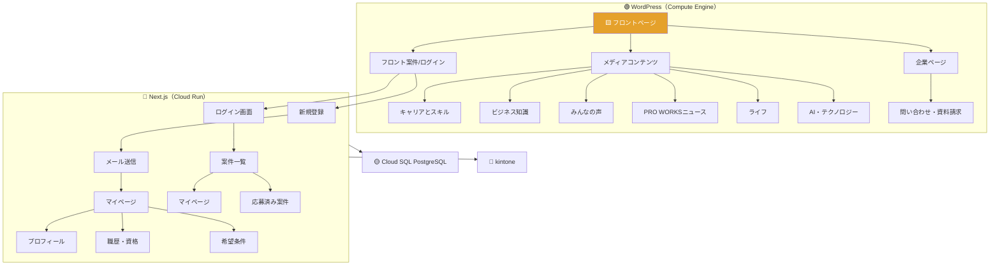
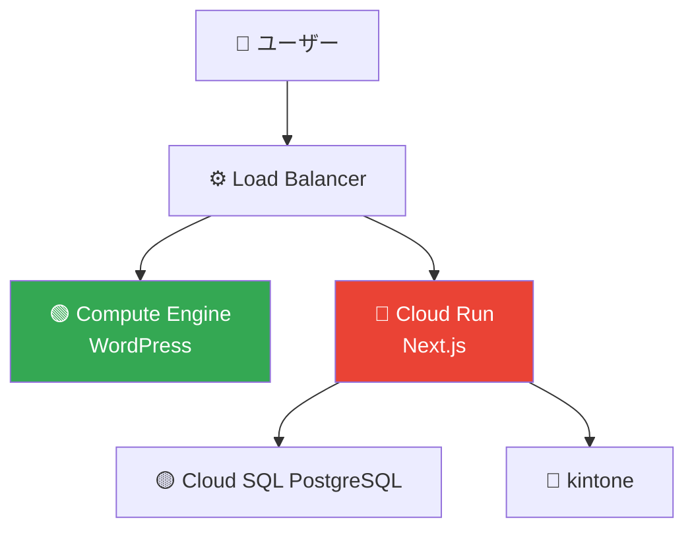

# PROWORKS インフラ構成図（GCP）

## サイトマップ × インフラ構成

---

## インフラ構成（シンプル版）

---

## 担当範囲

| 領域          | サービス                           | 内容                                                        |
| ------------- | ---------------------------------- | ----------------------------------------------------------- |
| **WordPress** | Compute Engine (MySQL 内蔵)        | フロント LP・フロント案件・メディア・企業ページ・問い合わせ |
| **Next.js**   | Cloud Run + Cloud SQL (PostgreSQL) | 新規登録・ログイン・案件一覧・マイページ・応募              |
| **kintone**   | SaaS                               | 案件マスタ・人材マスタ・応募履歴                            |
